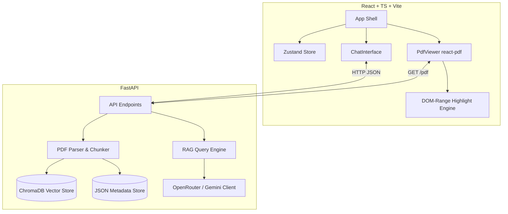
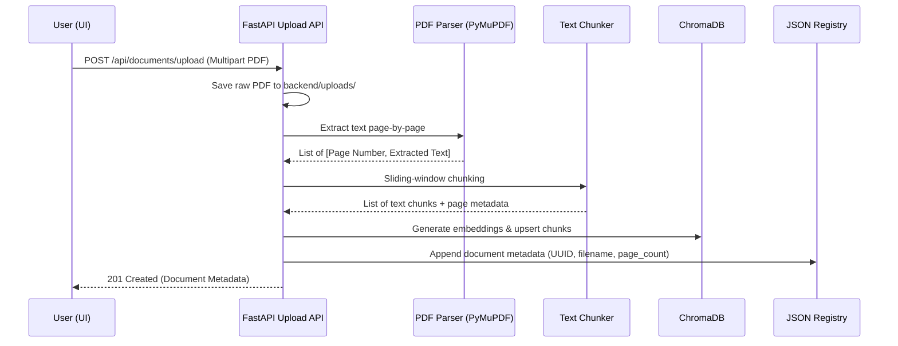
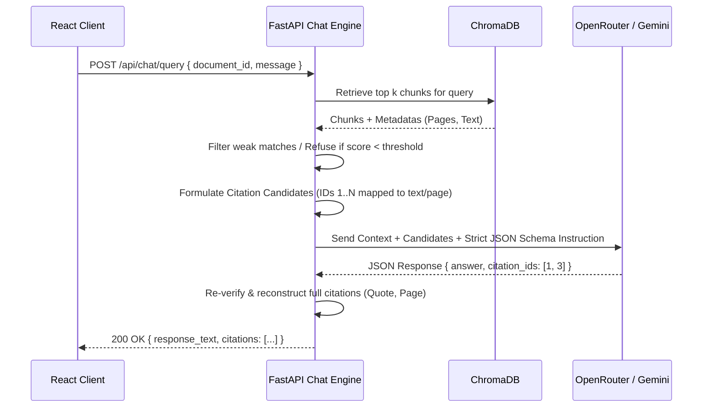

# 🏛️ Architecture Overview and Implementation Notes

Akino is a local, production-inspired Retrieval-Augmented Generation (RAG) system tailored specifically for document-level Q&A with strict citation verification and dynamic PDF highlighting. This document outlines the system architecture, core design patterns, data flows, and advanced implementation decisions.

---

## 🗺️ System Architecture

The project is structured as a decoupled fullstack application:



### 1. Frontend Architecture
*   **App Shell (`frontend/src/App.tsx`):** Coordinates the sidebar layout, PDF viewport, and AI conversation panels.
*   **State Management (`frontend/src/store/useAppStore.ts`):** Managed globally via **Zustand** to synchronize active documents, loaded chat histories, active citations, and application-wide loading indicators.
*   **Dynamic Highlighting Engine (`frontend/src/components/DocumentViewer/PdfViewer.tsx`):** Listens to citation focus changes and translates plain-text citation quotes into exact overlay highlights in the PDF's text layer using a custom DOM range calculator.

### 2. Backend Architecture
*   **FastAPI Web Framework (`backend/app/main.py`):** Serves API endpoints, handles errors, and manages CORS policies.
*   **Ingestion Pipeline (`backend/app/services/pdf_parser.py`):** Orchestrates physical PDF loading, text extraction, page normalization, sliding window chunking, and vector encoding.
*   **Local Persistence Layer:**
    *   **Vector Database:** **ChromaDB** (stored under `backend/data/chromadb`) index vectors and document metadata for search queries.
    *   **Document Registry:** Structured JSON database (`backend/data/documents.json`) tracking document names, file locations, page counts, and upload timestamps.

---

## 🔄 Core Data Workflows

### 📥 1. PDF Upload and Ingestion Flow



1.  **Extraction:** PyMuPDF (`fitz`) is preferred due to superior text order preservation. If PyMuPDF is not compiled, the system automatically uses a pure-python `pypdf` fallback.
2.  **Chunking:** Documents are split using a sliding window algorithm (chunk size: ~1000 characters, overlap: ~200 characters) to ensure contextual continuity across chunk boundaries.
3.  **Vectorization:** Embeddings are generated locally and inserted into ChromaDB with comprehensive metadata tags (`document_id`, `page_number`, `chunk_index`).

---

### 💬 2. RAG Query and Backend-Driven Citation Flow

A key innovation of Akino is the **Strict Citation Contract**, which protects the system against LLM hallucinations.



#### 🛡️ The Citation Contract Prompt Pattern:
The backend constructs a robust instruction prompt containing a list of numbered **Citation Candidates**:
```text
Context:
[Candidate 1] (Page 2): "Our revenue increased by 20% in the third quarter."
[Candidate 2] (Page 4): "Operating costs remained stable at $4.5 million."

Instructions:
You must answer the user's question using ONLY the provided candidates. 
For each fact you state, you must reference the exact Candidate ID.
Your output must match the JSON structure:
{
  "answer": "The company saw a 20% increase in revenue [1] while maintaining stable costs [2].",
  "citations": [1, 2]
}
```

If the LLM returns citation IDs that were not part of the candidate list, or tries to answer unsupported questions, the backend's validation layer rejects the hallucinated details and enforces a graceful refusal.

---

## 🎨 Citation Highlighting Design

Traditional RAG systems return page numbers, forcing users to read through entire pages. Akino solves this by implementing **pixel-perfect character-range highlighting**:

```text
               PDF RENDER LAYERS IN FRONTEND
+-----------------------------------------------------------+
|  Highlight Overlay Layer (Drawn over text using DOM Range) |
|  [===========================] (Vibrant Yellow Box)       |
+-----------------------------------------------------------+
|  SVG/HTML Text Layer (Normal browser text spans)           |
|  "Our revenue increased by 20% in the third quarter..."   |
+-----------------------------------------------------------+
|  Canvas Image Layer (Visual page layout & shapes)         |
+-----------------------------------------------------------+
```

### How Character-Range Matching Works:
1.  **Text layer rendering:** `react-pdf` renders the page and outputs standard HTML text layer container nodes (`.textLayer`).
2.  **Character Normalization:** The client reads all text content within the active page's text layer and creates a single contiguous string, storing the exact character index mapping to each underlying DOM text node.
3.  **Sub-string Alignment:** The backend's verified citation quote is normalized in the same way (collapsing whitespaces, converting to lowercase). A fast string search identifies the exact character offsets of the quote within the page's compiled string.
4.  **DOM Range Creation:** A standard browser `Range` object is created with its start and end offsets mapped directly across the text nodes.
5.  **Overlay Drawing:** The coordinate bounding boxes (`Range.getClientRects()`) are collected. The viewer draws absolute positioned overlay shapes at those precise coordinates.
6.  **Responsive Redrawing:** Highlights automatically recalculate and adjust coordinates during zoom changes, resize events, and page transitions.

---

## 📂 Data Storage Models

### 1. Document registry (`backend/data/documents.json`)
```json
{
  "docs": {
    "9d231e51-40ef-4f10-b98a-a636eb0135d5": {
      "id": "9d231e51-40ef-4f10-b98a-a636eb0135d5",
      "filename": "Q3_Report.pdf",
      "filepath": "backend/uploads/9d231e51-40ef-4f10-b98a-a636eb0135d5.pdf",
      "page_count": 12,
      "uploaded_at": "2026-05-25T15:17:33"
    }
  }
}
```

### 2. Vector Structure (ChromaDB)
*   **Collection name:** `document_workflow`
*   **Vector Dimensions:** Determined by local sentence-transformers (default: `384` for `all-MiniLM-L6-v2`).
*   **Metadata payload:**
    ```json
    {
      "document_id": "9d231e51-40ef-4f10-b98a-a636eb0135d5",
      "page_number": 2,
      "chunk_index": 5
    }
    ```

---

## 🔌 API Route Summary

| Method | Endpoint | Description | Payload Schema | Response Schema |
| :--- | :--- | :--- | :--- | :--- |
| **`POST`** | `/api/documents/upload` | Uploads & ingests PDF | `multipart/form-data` | `DocumentMetadata` |
| **`GET`** | `/api/documents/` | Lists all documents | None | `List[DocumentMetadata]` |
| **`GET`** | `/api/documents/{id}/pdf` | Downloads/serves original PDF | URL Parameter | File stream (`application/pdf`) |
| **`POST`** | `/api/chat/query` | Queries the RAG pipeline | `{ document_id, message }` | `{ answer, citations: [...] }` |
| **`GET`** | `/api/chat/{id}/history` | Fetches session chat history | URL Parameter | `List[ChatMessage]` |

---

## 🛡️ Production Considerations & Enhancements

For moving this application from local development to production, the following upgrades are recommended:

1.  **Asynchronous Ingestion Queues:** Move PDF extraction, chunking, and vector embedding from synchronous web requests into background queues (e.g., **Celery** or **Redis Queue**) to prevent timeouts on large documents.
2.  **Relational Database:** Replace the local JSON registries with a SQL database (**PostgreSQL** or **SQLite**) managed via SQLAlchemy or Prisma to support transaction safety, complex queries, and atomic operations.
3.  **Authentication & Multi-Tenancy:** Secure all routes by implementing JSON Web Tokens (JWT) and isolating vectors inside ChromaDB using tenant partitions or strict document metadata filtering.
4.  **Scanned PDF support (OCR):** Add a pre-processing pipeline using an OCR tool (e.g., Tesseract OCR or PaddleOCR) to extract text layers from scanned/image-only PDFs.
5.  **Rate-Limiting & High Availability:** Add circuit breakers for OpenRouter API requests, implement Redis cache layers, and set strict API rate limits to protect backend servers.
